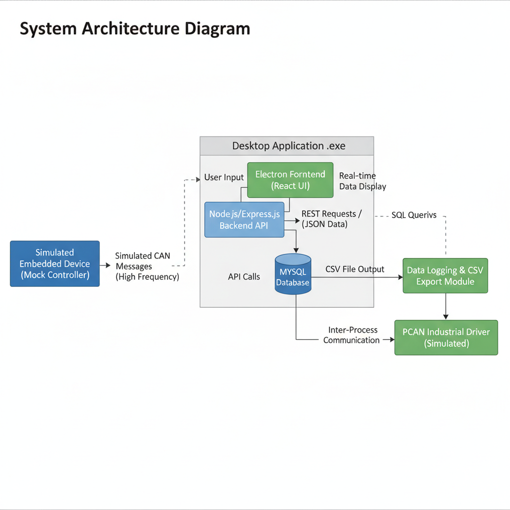
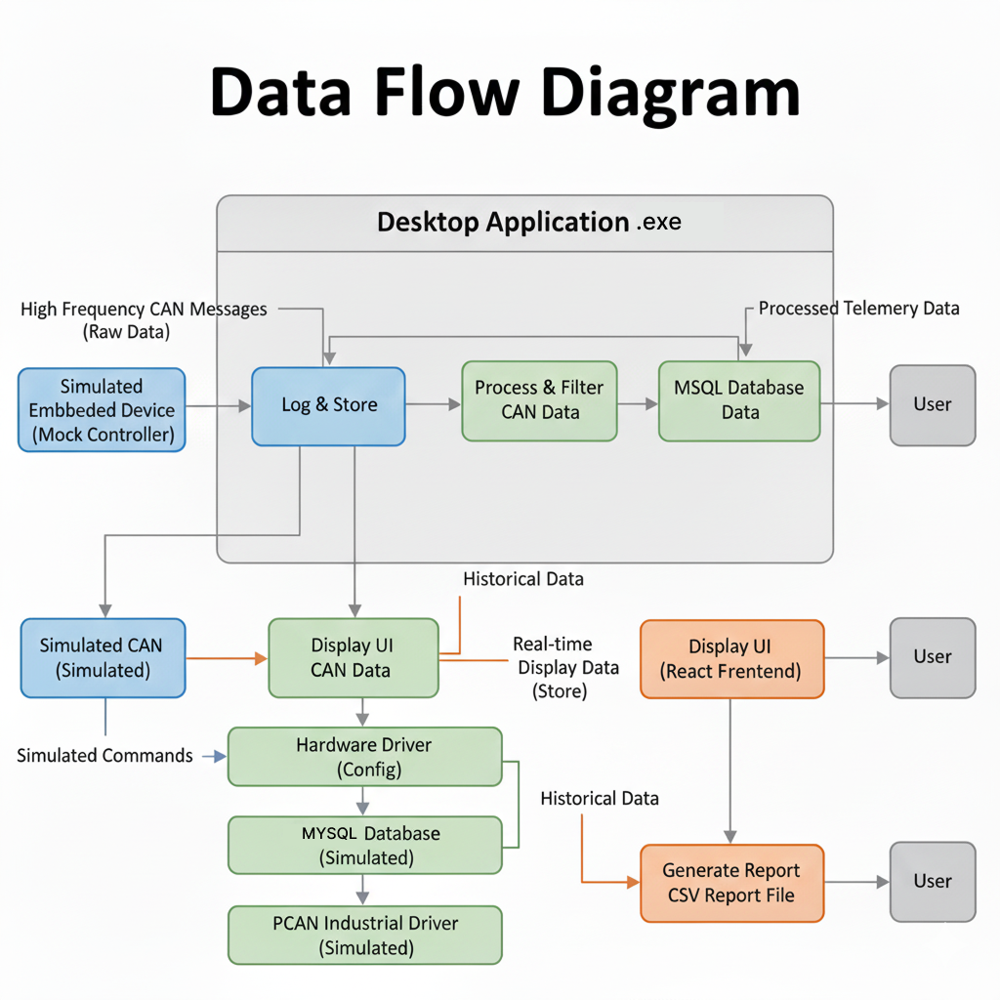
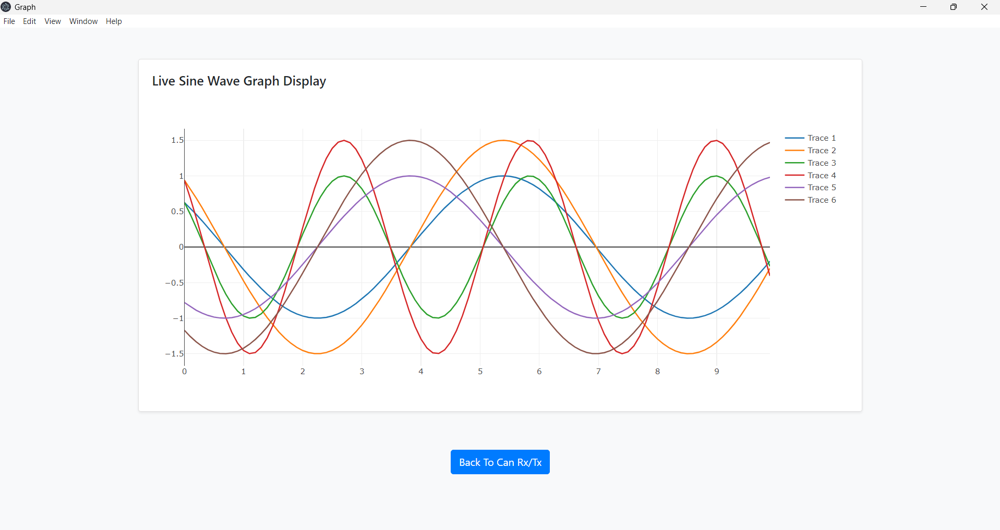
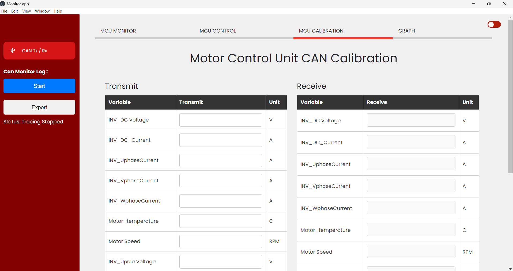
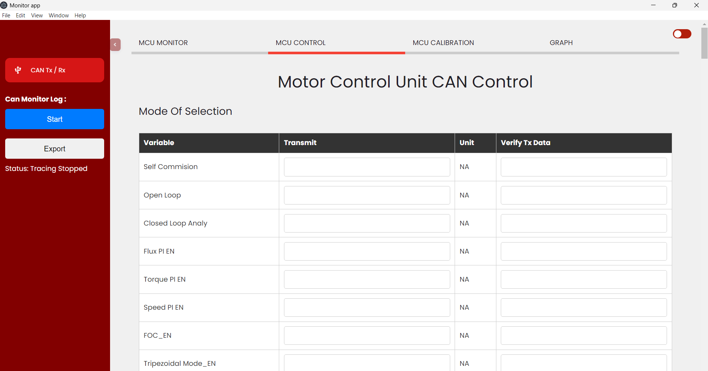
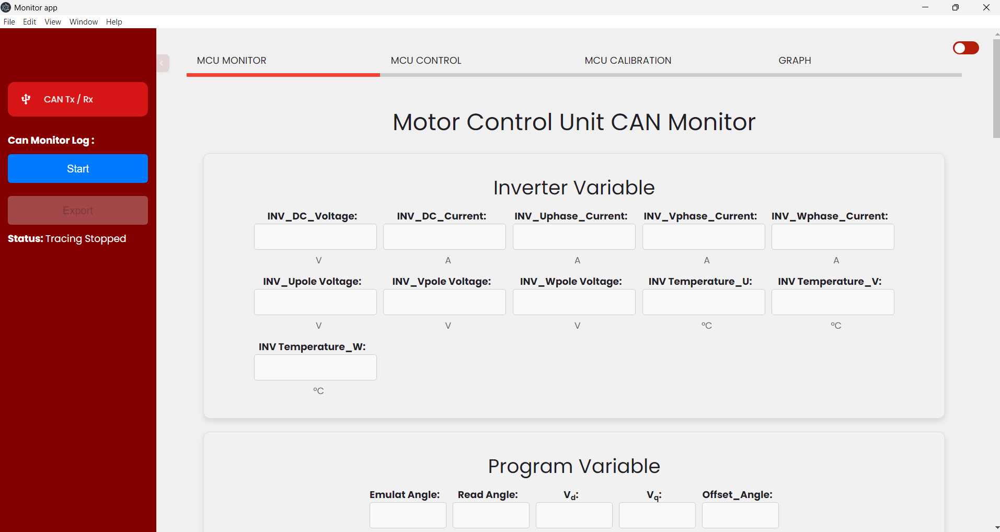
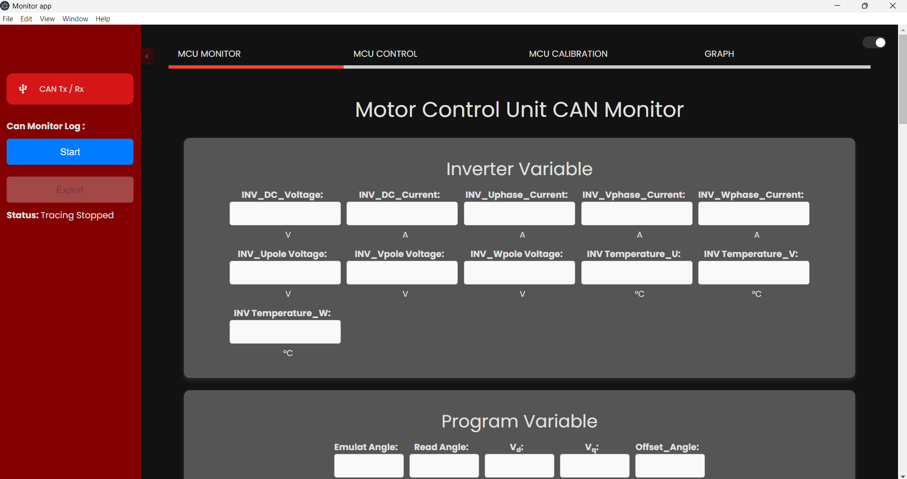

# Motor-Tuning-Desktop-App-Version-1

Full-stack Electron - React desktop app for high-frequency industrial data logging &amp; control of a simulated Motor Control Unit (MCU) using Node.js/MySQL. Successfully delivered core features while proactively identifying critical performance bottlenecks (memory saturation, scalability) and detailing a robust optimization plan.

# ⚙️ Motor Tuning Software (NDA-Safe Portfolio Version)

This repository presents a **mock / NDA-safe version** of a complex desktop application I developed during my professional experience in the automotive technology sector. This project demonstrates end-to-end expertise across the full stack, focusing on industrial communication, high-frequency data management, and desktop application development.

---

## 🚀 Project Overview

The core objective was to build a robust Windows desktop application to interface with, configure, and manage high-speed data logging from a simulated Motor Control Unit (MCU).

- **Role:** Full-Stack Desktop Application Engineer
- **Duration:** May - July 2024 (3-month sprint)
- **Project Version:** V1 (Focus on core functionality and performance identification)

### 💻 Technical Stack

| Category | Technologies Used |
| :--- | :--- |
| **Desktop Framework** | **Electron.js, Node.js** |
| **Frontend** | **React**, HTML, CSS, JavaScript |
| **Backend/API** | Node.js, Express.js |
| **Database** | MySQL (Local Deployment) |
| **Industrial Simulation** | Mock Controller (Simulated CAN Messages) |
| **Deployment** | Windows `.exe` Packaging |
| **Development Tools** | VS Code, DBeaver |
| **Operating System** | Windows |


### 🛠️ Tools and Testing Used

This project required specific tools for development, database management, and API validation:

| Tool Category | Tools Used | Purpose |
| :--- | :--- | :--- |
| **API Testing** | **Postman** or **Insomnia** | Validating and debugging all Backend API endpoints (CRUD operations). |
| **Database Management** | **MySQL Workbench** | Database schema design, querying, data restoration, and maintenance. |
| **Hardware Interfacing** | **PCAN Driver** | The necessary low-level driver for industrial bus communication (simulated in this mock version). |
| **Development** | **Node.js, npm/Yarn** | Package management and runtime environment for the entire application. |
| **CAN Bus Monitoring** | **PCAN-View Software** | Used for real-time monitoring, testing, and debugging of raw CAN bus messages and device communication. |

---

## ✨ Features & Accomplishments

The application successfully delivered core control and data management utilities in a stable, compiled environment.

1.  **Desktop Application (`.exe`):** Developed a reliable, standalone desktop application for Windows using **Electron**, ensuring smooth execution and stability.
2.  **Modern Frontend:** Built a modular, maintainable user interface using **React** components, ensuring a cohesive UX while fetching and displaying data.
3.  **Full-Stack Integration:** Achieved robust integration between the React UI, Node.js/Express API, and local MySQL database for seamless data flow.
4.  **Embedded Device Simulation:** Designed a system to communicate with a **Motor controller**, effectively simulating high-frequency CAN messages and industrial communication protocols.
5.  **Data Logging & Export Utility:** Implemented continuous data logging to the database with a feature to export the collected information into a standardized **CSV format** for external analysis.
6.   **API Testing:** Validated all endpoints with Postman / Insomnia

---

## 📈 Challenges and Performance Optimization

The project’s most valuable outcome was the identification and planning to resolve several complex performance and scalability issues inherent in high-frequency data applications.

| Identified Challenge | Solution Strategy (Planned/Proposed) |
| :--- | :--- |
| **High Processing Load** | High frequency data processing (simulating 8 times per second) led to excessive CPU and RAM usage in the backend. | **Strategy:** Implement intelligent **throttling and buffering** mechanisms to **decouple data ingestion from storage**, reducing unnecessary processing demands. |
| **Memory & Storage Saturation** | Intensive, high-frequency data storage caused high RAM consumption and rapid filling of local storage (MySQL) over extended periods. | **Strategy:** Plan and implement comprehensive **memory leak analysis** and efficient **data retention and archival** policies to manage local disk capacity. |
| **Scalability & Data Redundancy** | The initial data model risked redundant entries, limiting the system's ability to scale with an increasing volume of monitored parameters. | **Strategy:** Refactor the backend data model and storage logic to enforce data uniqueness and adopt a modular architecture for future expansion. |


> In this open-source portfolio version, hardware-dependent features are safely simulated with mock data.

---

## Project Structure

```
galaxi-motor-tuning-portfolio/
│
├─ src/
│   ├─ frontend/         # Electron + React application interface
│   ├─ backend/          # Node.js + Express REST API server
│   └─ database/         # MySQL schema definition and sample data scripts
│
├─ tests/
│   └─ api-tests/        # Postman or Insomnia API testing collections
│
├─ diagrams/
│   ├─ system_architecture.png
│   └─ data_flow.png
│
├─ mockups/
│   └─ *.png files       # All application mockup screenshots (NDA-safe)
│
├─ docs/
│   └─ installation.md   # Simplified instructions to run the mock environment
│
└─ README.md
```

---

## Installation (NDA-Safe Version)

1. Install **MySQL** and **DBeaver** (for DB management).  
2. Clone this repo and restore the sample database from `/src/database/`.  
3. Open the project in **VS Code**.  
4. Start the backend server:  
   ```bash
   cd src/backend
   npm install
   node server.js
   ```
5. Start the Electron + React frontend:  
   ```bash
   cd src/frontend
   npm install
   npm start
   ```
6. (Optional) Run API tests using **Postman** or **Insomnia**.

> ⚠️ This portfolio version utilizes mock data and does **not require any actual hardware or proprietary drivers** to run.

---

## 🖼️ System Architecture Diagram & Data Flow Visualization

**System Architecture Diagram**


**Data Flow Diagram**


---

## 🖼️ Application Interface Mockups

Here are visualizations of key screens and features within the application:

### 📊 Data Visualization and Analysis

*This screen displays real-time data using Plotly.js, illustrating high-frequency data logging.*

### ⚙️ Calibration and Configuration

*The module used for system calibration and configuration management.*

### 💻 Transmission (TX) Screen

*Interface dedicated to managing and controlling data transmission to the embedded device.*

### 🌓 Theme Options
| Light Mode | Dark Mode |
| :---: | :---: |
|  |  |
*Demonstrates a modern, flexible UI supporting light and dark themes.*

---

## ⭐ Skills Demonstrated

* **Desktop Application Development** using **Electron**.
* Frontend development with **React (latest)** and modular UI components.
* Backend REST API development with **Node.js & Express**.
* Database design and integration using **MySQL** and **MySQL Workbench**.
* Proficiency with **Postman/Insomnia** for API validation.
* Understanding and simulation of **Embedded Device Integration** logic.
* Advanced problem-solving for **memory management, scalability, and performance optimization**.

### 🔒 Note on Confidentiality

* No proprietary source code, specific company names, or sensitive internal data is included in this repository.
* The project serves to demonstrate my real-world technical capabilities in compliance with Non-Disclosure Agreements (NDAs).

---

## Project Status

✅ Completed (Version 1)  
📈 Optimizations planned for scalability and memory management

